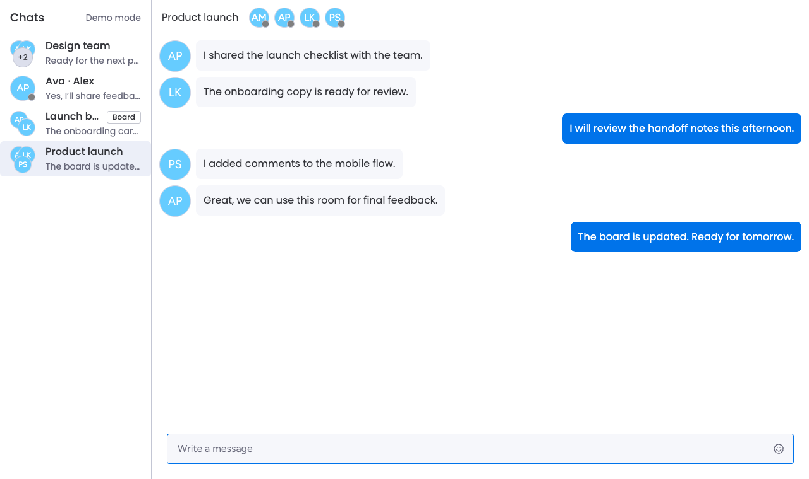

# MimiChat — React chat UI showcase

MimiChat is a chat interface I built in early 2024 for monday.com workspace and board views. This repository presents that React/TypeScript work through a self-contained, fictional demo. It is an independent portfolio project, not an official monday.com product.



## What to look at

- Two surfaces: a workspace chat with a room list, and a board-specific conversation.
- Message composition, mentions, emoji, replies, room previews, and read/typing UI states.
- Domain models for messages, rooms, users, and parsed message content, separated from UI components.
- An in-memory demo adapter that updates the active conversation and room preview when a message is sent, while retaining messages as you switch rooms.

The original UI and domain work dates from 2024. In 2026 I created this showcase with fictional content, a mock adapter, focused tests, and fresh Git history. Search, reactions, notifications, room management, and service-backed behavior visible in the historical source are not functional in the demo.

## Run the demo

Use Node 20.19+ or 22.12+:

```sh
npm ci
npm run dev:mock
```

Open the URL printed by Vite. To see the board view, run `npm run dev:board:mock` in another terminal and open its URL. Both views need no account, credentials, or backend.

```sh
npm run lint
npm test
npm run build
```

GitHub Actions runs these checks. `npm run build` builds both mock views. The demo store's tests cover sending a message, updating the room preview, retaining messages across room switches, and avoiding duplicate updates.

## How the showcase is separated

The mock Vite configurations resolve `@chat` to [`src/app/chatMock.ts`](src/app/chatMock.ts), which uses the in-memory [`MockMessageStore`](src/app/mockMessageStore.ts). The mock entry points render the workspace and board views directly. The built demo contains no Monday OAuth or Firebase adapter code.

The original service-backed path remains in `src/app/chat.ts` and `src/infrastructure/` as historical source for review. It is outside the showcase build and its service dependencies are not installed by `npm ci`. That path has not been configured, updated, or verified here.

## Limits

Messages are stored only in memory and disappear on reload. The demo does not provide real authentication, multi-user sync, persistence, notification delivery, search, room management, or a production service connection. Do not deploy it as a production chat service. No real account data, service credentials, or earlier Git history are included.

The UI retains its historical monday.com design-system dependency. Review and modernize that dependency before deploying any derivative product.
